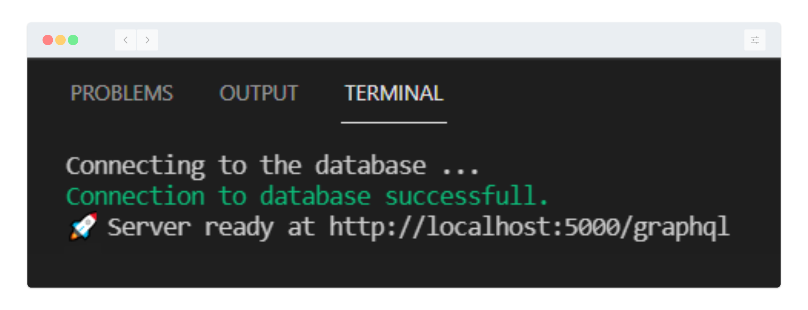

# GraphQL Blog Server with Node Backend

This Repository contains code for backend of a basic blog application.

## 📜 Tech-Stack Used:

<p align="left"> 
  <a href="https://nodejs.org" target="_blank"> 
   
  </a> 
  <a href="https://developer.mozilla.org/en-US/docs/Web/JavaScript" target="_blank"> 
   
  </a> 
  <a href="https://expressjs.com" target="_blank"> 
   
  </a> 
  <a href="https://jwt.io/" target="_blank"> 
   
  </a> 
  <a href="https://graphql.org" target="_blank"> 
   
  </a> 
  <a href="https://www.apollographql.com/" target="_blank"> 
   
  </a> 
  <a href="https://www.mongodb.com/" target="_blank"> 
   
  </a> 
  <a href="https://postman.com" target="_blank"> 
   
  </a>
</p>

</br>

## 💾 Installation and usage

1. Clone the repo:

```
https://github.com/am-chourasia/MyBlog.git
```

2. Setup the environement variable from the .env environment given.
3. Open the terminal and start the server:

```
cd server
npm start
```

  

4. Open the url and start querying :)

## 📂 Server Folder Structure

```
.
├── directives // custom directive for authorization
├── helpers   // helpers for database connection and authentication
├── model     // models for mongoDB database
├── resolvers   // resolvers for graphql queries and mutations
└── typeDefs    // schemas for graphql server
```

## 📑 Overview

The GraphQL Schema provides two objects:

1. Users
2. Posts

These two objects contains various fields which can be used by frontend. \
`JWT` Authentication and Authorization for all signed in user with Custom Directive is also provided. \
The password entered by user is encripted before being added to the database with the `bcrypt` library.
</br>
</br>

### Features that can be added:

1. Adding Comments feature for the posts, linking it with users commenting on the post.
2. 'Follow' features for users to follow other users.
